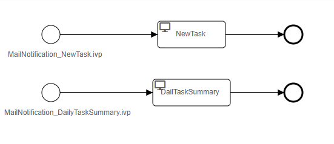

# Custom Mail Demo

Axon Ivy’s Custom Mail Demo shows how to customize the task notification emails and daily task summary emails by providing your own mail processes. This demo:

- Supports you with an easy-to-copy example implementation to reduce your integration effort.
- Enables low code citizen developers to modify standard functionalities of the Axon Ivy Engine easily.

Learn more about custom mail processes in our 
[documentation](https://developer.axonivy.com/doc/dev/designer-guide/user-interface/email-notifications/index.html)

## Demo

The demo process `mail` has two process starts. One for the new task email notification and one for the daily task summary email. Feel free to take this demo as a template to implement your own email processes.

## Setup

Deploy this demo project to an Axon Ivy Engine and
trigger the creation of a task. All responsible users
will get a new task notification mail with the content
of this standard process.
