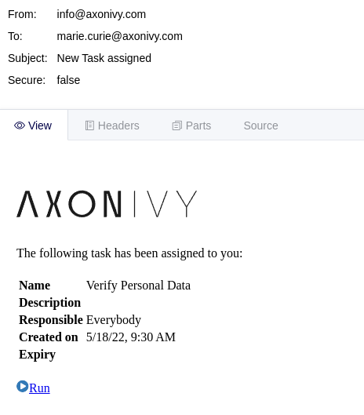
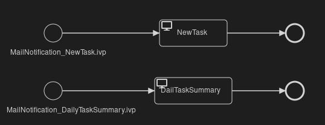

# Veraltet

Der benutzerdefinierte E-Mail-Prozess existiert seit Axon Ivy 11.2 nicht mehr.
Um den Inhalt einer E-Mail zu ändern, können Sie die E-Mail-Vorlage ändern.
Weitere Informationen finden Sie unter
[Benachrichtigungen](https://dev.axonivy.com/doc/11.2/concepts/notification/index.html).

# Benutzerdefinierte E-Mail-Demo

Die Custom Mail Demo von Axon Ivy zeigt, wie Sie die E-Mails mit
Aufgabenbenachrichtigungen und täglichen Aufgabenübersichten anpassen können,
indem Sie Ihre eigenen E-Mail-Prozesse bereitstellen. Diese Demo:

- Unterstützt Sie mit einer einfach zu kopierenden Beispielimplementierung, um
  Ihren Integrationsaufwand zu reduzieren.
- Ermöglicht Low-Code-Citizen-Developern, Standardfunktionen der Axon Ivy Engine
  einfach zu ändern.

Weitere Informationen zu benutzerdefinierten E-Mail-Prozessen finden Sie in
unserer
[Dokumentation](https://developer.axonivy.com/doc/dev/designer-guide/user-interface/email-notifications/index.html).

## Demo

Der Demo-Prozess `mail` umfasst zwei Prozessstarts. Einen für die
E-Mail-Benachrichtigung über neue Aufgaben und einen für die tägliche
E-Mail-Zusammenfassung der Aufgaben. Sie können diese Demo gerne als Vorlage für
die Implementierung Ihrer eigenen E-Mail-Prozesse verwenden.

## Setup

Stellen Sie dieses Demo-Projekt auf einer Axon Ivy Engine bereit und lösen Sie
die Erstellung einer Aufgabe aus. Alle zuständigen Benutzer erhalten eine
E-Mail-Benachrichtigung über eine neue Aufgabe mit dem Inhalt dieses
Standardprozesses.
